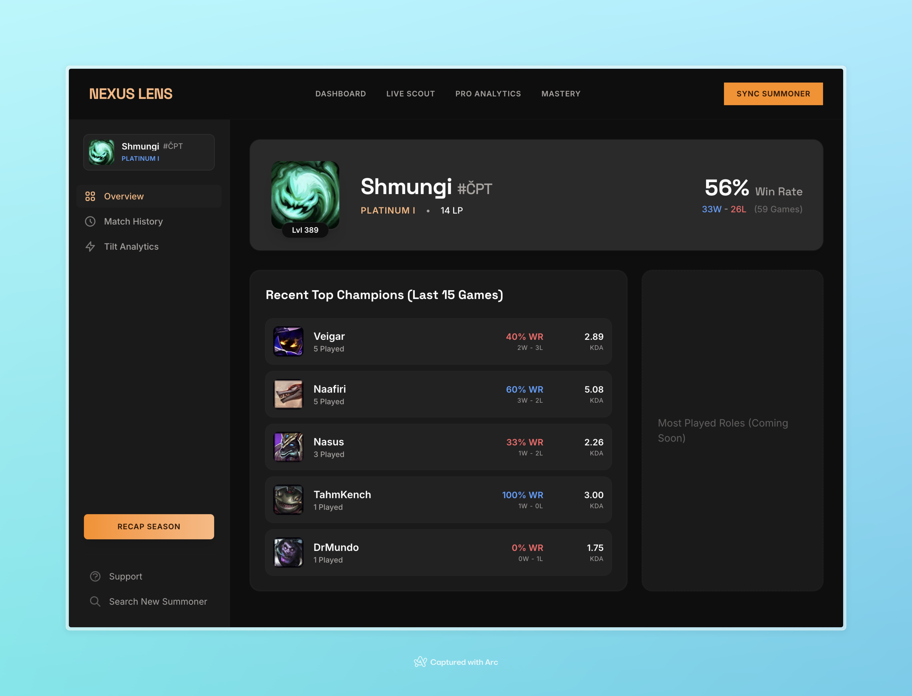
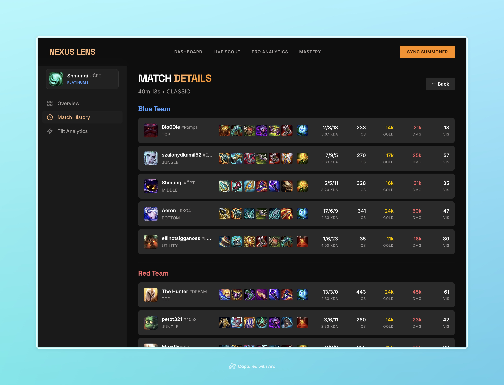

# My Riot App - League of Legends Stats Dashboard

A modern, high-fidelity League of Legends player statistics dashboard built with SvelteKit and the Riot API. Track your ranked performance, analyze match history, and visualize your gameplay stats in real-time.

🔗 **Live Demo:** [my-riot-app-svelte.vercel.app](https://my-riot-app-svelte.vercel.app)

## 📸 Screenshots

### Dashboard Overview

View your summoner profile with ranked tier, win rate, and recent top champions at a glance.



### Match Analysis

Deep dive into individual match performance with detailed game statistics and player metrics.



## ✨ Features

- **Player Lookup** - Search and sync League of Legends summoner data using Riot API
- **Dashboard Analytics** - View ranked tier, win rate, LP progression, and summoner level
- **Champion Performance** - See your top 5 most-played champions with win rates and KDA stats
- **Match History** - Browse detailed match history with pagination support
- **Match Details** - Analyze individual game performance with comprehensive statistics
- **Responsive Design** - Beautiful UI optimized for desktop and mobile with dark-mode aesthetic
- **Real-time Updates** - Fetch live data from Riot's API

## 🛠️ Tech Stack

- **Framework:** SvelteKit
- **Language:** TypeScript
- **Styling:** Tailwind CSS
- **API:** Riot Games API
- **Testing:** Vitest, Playwright
- **Components:** Storybook
- **Build Tool:** Vite
- **Deployment:** Vercel

## 📦 Installation

### Prerequisites

- Node.js 18+ and npm
- Riot API key (get one at [developer.riotgames.com](https://developer.riotgames.com))

### Setup

```bash
# Clone the repository
git clone https://github.com/Zetchu/my-riot-app-svelte.git
cd my-riot-app-svelte

# Install dependencies
npm install

# Create .env.local with your Riot API key
echo "RIOT_API_KEY=your_api_key_here" > .env.local

# Start development server
npm run dev
```

The app will be available at `http://localhost:5173`

## 📜 Available Scripts

### Development

```bash
npm run dev
```

Starts the development server with hot module reloading. Perfect for active development.

### Build

```bash
npm run build
```

Creates an optimized production build. Output goes to the `build/` directory.

### Preview

```bash
npm run preview
```

Preview the production build locally before deploying.

### Testing

#### Unit Tests

```bash
npm run test:unit
```

Run Vitest unit tests with watch mode. Use `npm run test` to run once without watch.

```bash
npm test
```

Run all unit tests once and exit.

#### E2E Tests

```bash
npm run e2e
```

Run Playwright end-to-end tests. Tests are located in the `tests/` directory.

### Code Quality

#### Linting

```bash
npm run lint
```

Check code with ESLint and Prettier (no changes made).

#### Formatting

```bash
npm run format
```

Auto-format all code with Prettier.

```bash
npm run format:check
```

Check formatting without making changes.

#### Type Checking

```bash
npm run check
```

Run SvelteKit sync and type-check with TypeScript.

```bash
npm run check:watch
```

Run type-checking in watch mode for real-time feedback.

### Documentation & Component Development

#### Storybook

```bash
npm run storybook
```

Start Storybook dev server on port 6006 for isolated component development and documentation.

```bash
npm run build-storybook
```

Build a static Storybook site for deployment.

## 🎯 Project Structure

```
src/
├── lib/
│   ├── components/        # Reusable UI components
│   ├── stores/           # Svelte reactive state (summoner, match data)
│   ├── types.ts          # TypeScript interfaces
│   └── assets/           # Static assets
├── routes/
│   ├── api/              # Server endpoints for Riot API calls
│   ├── dashboard/        # Main dashboard page
│   └── player/           # Player lookup page
└── stories/              # Storybook component stories
```

## 🔐 Environment Variables

Create a `.env.local` file in the project root:

```env
RIOT_API_KEY=your_riot_api_key_here
```

## 📖 Usage Guide

### 1. Search for a Summoner

Navigate to the home page and search for a League of Legends summoner by name and tag (e.g., "PlayerName#NA1").

### 2. View Dashboard

Once synced, you'll see:

- Summoner profile with rank and level
- Win rate and LP progression
- Top 5 champions by games played

### 3. Browse Match History

Click "Match History" to view recent matches. Matches are paginated with a "Load More" button.

### 4. Analyze Match Details

Click on any match to see detailed statistics including:

- K/D/A (Kills, Deaths, Assists)
- CS (Creep Score)
- Damage dealt
- Gold earned
- Items built

## 🚀 Deployment

The app is automatically deployed to Vercel on every push to the main branch.

### Manual Deployment

```bash
npm run build
npm run preview
```

## 📝 Contributing

Contributions are welcome! Please follow the existing code style and run linting/formatting before submitting PRs:

```bash
npm run lint
npm run format
npm run test
```

## 📄 License

This project is open source and available under the MIT License.

## 🤝 Support

- [Riot API Documentation](https://developer.riotgames.com/docs/lol)
- [SvelteKit Docs](https://kit.svelte.dev)
- [Report Issues](https://github.com/Zetchu/my-riot-app-svelte/issues)

---

\*_Made with ❤️ by a David_
